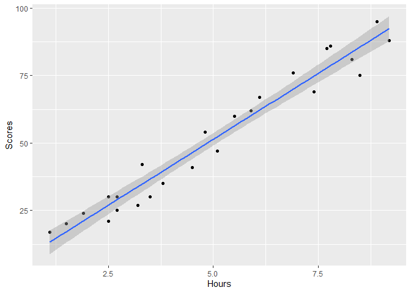

Predicting Scores using hours
================
Martin
10/12/2021

## Introduction

This document details the steps firstly,to understand the relationship
model between two variables -

The independent variable - Hours & The dependent variable - Scores

Secondly, it details further steps taken to use the understood
relationship model and apply it onto another independent variable - Hour
to try to predict the dependent variable - Score.

### Loading the required packages.

The first step was to load the pre-installed packages into R.

``` r
library(tidyverse)
```

    ## -- Attaching packages --------------------------------------- tidyverse 1.3.1 --

    ## v ggplot2 3.3.5     v purrr   0.3.4
    ## v tibble  3.1.6     v dplyr   1.0.7
    ## v tidyr   1.1.4     v stringr 1.4.0
    ## v readr   2.1.0     v forcats 0.5.1

    ## -- Conflicts ------------------------------------------ tidyverse_conflicts() --
    ## x dplyr::filter() masks stats::filter()
    ## x dplyr::lag()    masks stats::lag()

``` r
library(ggplot2)
```

### Adding the data.

with that done, the csv file was read into R using the read_csv()
function:

``` r
score_hour<-read_csv("Score_hour.csv")
```

    ## Rows: 25 Columns: 2

    ## -- Column specification --------------------------------------------------------
    ## Delimiter: ","
    ## dbl (2): Hours, Scores

    ## 
    ## i Use `spec()` to retrieve the full column specification for this data.
    ## i Specify the column types or set `show_col_types = FALSE` to quiet this message.

``` r
print(score_hour)
```

    ## # A tibble: 25 x 2
    ##    Hours Scores
    ##    <dbl>  <dbl>
    ##  1   2.5     21
    ##  2   5.1     47
    ##  3   3.2     27
    ##  4   8.5     75
    ##  5   3.5     30
    ##  6   1.5     20
    ##  7   9.2     88
    ##  8   5.5     60
    ##  9   8.3     81
    ## 10   2.7     25
    ## # ... with 15 more rows

As evident from the statements above, the data has been loaded. There
are 25 rows of data and two columns - Hours & Scores.

### Understanding the relationship between the two variables.

To check the if there is a relation between the variables Hours & Scores
and the percentage of that relation, cor() function was used.

``` r
cor(score_hour$Hours,score_hour$Scores)
```

    ## [1] 0.9761907

The result is 0.9761907, which can be interpreted as 97.61% positively
correlated.

To check the cause and effect relationship between the two variables
(Hours & Scores). A scatter plot graph was plotted with function :
ggplot() +geom_point()(scatterplot) & geom_smooth(straight line).

Below are the codes and the resulting graph.

``` r
score_hour %>%   ggplot(aes(x=Hours,y=Scores))+geom_point()+geom_smooth(method = "lm")  
```

    ## `geom_smooth()` using formula 'y ~ x'

<!-- -->

The graph is clear. There is a direct effect of the Hours variable on
the Scores variable. This linear relationship between two variables is
called simple linear regression.

We run the following code to generate a linear model describing the
relationship effect of ‘Hours’ on ‘Scores’

``` r
relation<-lm(Scores~Hours,data = score_hour)
```

The above code calculates the effect on ‘Scores’ by ‘Hours’ by using the
data available and using the equation of the linear model lm().

We then generate a summary.

``` r
summary(relation)
```

    ## 
    ## Call:
    ## lm(formula = Scores ~ Hours, data = score_hour)
    ## 
    ## Residuals:
    ##     Min      1Q  Median      3Q     Max 
    ## -10.578  -5.340   1.839   4.593   7.265 
    ## 
    ## Coefficients:
    ##             Estimate Std. Error t value Pr(>|t|)    
    ## (Intercept)   2.4837     2.5317   0.981    0.337    
    ## Hours         9.7758     0.4529  21.583   <2e-16 ***
    ## ---
    ## Signif. codes:  0 '***' 0.001 '**' 0.01 '*' 0.05 '.' 0.1 ' ' 1
    ## 
    ## Residual standard error: 5.603 on 23 degrees of freedom
    ## Multiple R-squared:  0.9529, Adjusted R-squared:  0.9509 
    ## F-statistic: 465.8 on 1 and 23 DF,  p-value: < 2.2e-16

The summary function presents all the important parameters in tabular
form for our purpose.

the estimate is 9.7758. For every 1% increase in hours,there is an
increase of 9.7758% in Scores. the intercept is 2.4837, which is the
predicted value of Scores(dependent variable) when Hours(independent
variable) is 0.

### Predicting the score(percentage), if hour=9.25

Any value of dependent variable (Scores) within the parameters can be
predicted using the linear regression formula. For example:

to find the predicted score if the Hours=9.25, the following formula was
used

Predicted Score= intercept(2.4837) + estimate(9.7758) \* 9.25

run the following code to compute in R

``` r
y<-2.4837+9.7758*9.25 
print(y)
```

    ## [1] 92.90985

The predicted score for studying 9.25 hrs is 92.91

Alternatively,the predict() function can also be used to predict the
score.

The linear regression - relation\<-lm(Scores\~Hours,data = score_hour)
as shown before, was used along with the predict() function as under:

``` r
newdata=data.frame(Hours=9.25)
Score_pred <-predict(relation,newdata)
print(Score_pred)
```

    ##        1 
    ## 92.90985

The predicted score is once again 92.91%.

Documentation ends.

Thank you for your time.
